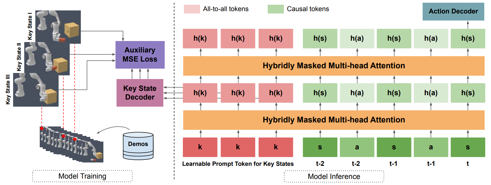

# Chain-of-Thought Predictive Control (CoTPC)
This is the official repository for CoTPC, a powerful hierarchical imitation learning model presented in the following paper:

### **[Chain-of-Thought Predictive Control](https://zjia.eng.ucsd.edu/cotpc)** 
Zhiwei Jia, Fangchen Liu, Vineet Thumuluri, Linghao Chen, Zhiao Huang, Hao Su 
UC San Diego, UC Berkeley, Zhejiang University 

   
  <a href="https://arxiv.org/abs/2304.00776">[arXiv]</a>&emsp;<a href="https://zjia.eng.ucsd.edu/cotpc">[website]</a>

### Tasks
Currently the code supports five tasks from the [ManiSkill2](https://github.com/haosulab/ManiSkill2) benchmark: 
`PickCube-v0`, `StackCube-v0`, `PegInsertionSide-v0`, `TurnFaucet-v0`, and `PushChair-v1`.

### Demonstration Data
The state-based demo trajectories used in the paper are stored in this Googld Drive [folder](https://drive.google.com/drive/folders/1VdunXUlzqAvy-D8MniQ4anhV5LLBfNbJ).
Each folder has a `*.h5` file (for actual trajectories) and a `*.json` file (for metadata regarding the trajectories).
Each task has over 1000 demo trajectories.
Each trajectory comes with a different env configurations (i.e., env seed, which influences object poses, object geometries, etc.).
These demos are generated by replaying the official ManiSkill2 [demos](https://github.com/haosulab/ManiSkill2#demonstrations) or the ones adapted from [this](https://github.com/caiqi/Silver-Bullet-3D/tree/master/No_Restriction) repo with several patches to the ManiSkill2 code (see `CoTPC/maniskill2_patches`).
Specifically, we add additional flags to the tasks so that the key states (the Chain-of-Thought) can be obtained with priviledged information from the simulator.
For the task `TurnFaucet-v0`, we use a subset of 10 faucet models for the demos (see `CoTPC/scripts/replay_turn_faucet_trajectories.sh`).
For the task `PushChair-v1`, we use a subset of 5 chair models for the demos.
If you want to generate visual-based demos, please refer to the official ManiSkill2 guidance [here](https://github.com/haosulab/ManiSkill2#demonstrations).

### Data Loader
The data loader samples (contiguous) subarrays of demo trajectories by specifying the min and max sample lengths. 
In CoTPC, we simply use a fixed value for both min and max (e.g., set the context size as 60 for all of the 5 tasks from ManiSkill2).
With a fixed random seed `seed` and `num_traj`, each time the data loader samples a fixed subset of all trajectories (by default, we use `seed=0`).
For TurnFaucet and PushChair, due to the variations of the different object models, the loader performs sampling such that the number of trajs
per model is the same (hopefully this data balance eases model training).
The key states (a.k.a the Chain-of-Thought) can be obtained with the function `get_key_states(data_idx)` that accesses privileged info available during training.

### Evaluation
We patch the environment code from ManiSkill2 (see `CoTPC/maniskill2_patches`) to provide additional evaluation metrics (intermediate success rate) each task execution.
We report evaluation results for models using both the seen env configurations and the unseen env configuration.
For tasks involving geometric variations we also evaluate using unseen objects (i.e., zero-shot transfer).
Please refer to `CoTPC/src/eval.py` for details.
<!-- I equip it with `vec_env.py` to boost up the evaluation process (it will still take several minutes to evaluate on 500 envs, FYI). -->
<!-- The metrics used here are `success` and flags for some other intermediate key states specific to each task. -->
<!-- We also set a maximum timesteps allowed for each of the four tasks (see details in `eval_starter.py`). -->

### Sampled Training Scripts
Please see `CoTPC/scripts/train.sh` as examples.